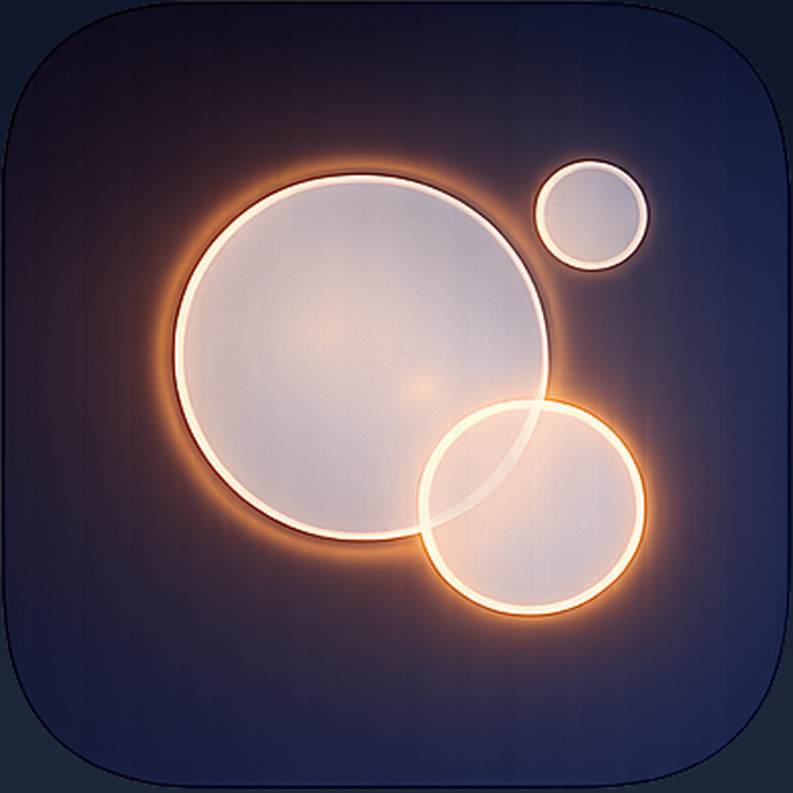

# Self-introduction

## AWA - AnytimeWithAgents v1.0.1

**思考と実行を拡張するAI OS**
AI OS that extends thinking and execution

#AnytimeWithAgents #AI #iOS #Agent

---

## Profile

| key | value |
| --- | --- |
| name | Kaoru Nozue |
| Qiita | @Nozium |
| note | @knozue |
| twitter | @Nozium1 |
| Wantedly | @kaoru_nozue |

## ****Profile Supplements****

| key | value |
| --- | --- |
| Language | JP / EN |
| Background | Nuroscience / Biochemicals / EEG Analytics  |
| Programing Language | Main : Python3 (TS / CV / NLP / web-API)   Sub : HTML / JavaScript / CSS (for mock up product) |
| New Charenge | - ALIFE / WBA  - Knowledge-Graph / AI-Novel-Writing / Knowledge-Compression / Hyper-Availability  - Crypto / x-to-earn  - Join to competitions |
| Hobbies | - Drip and Drink Coffee  - Read new brain-tech / neuro-tech research |

## Summary

Building AI-powered tools that extend human thinking and execution.

Currently focused on:
- **AWA (AnytimeWithAgents)** - iOS app combining AI Agent + SSH Terminal + Apple Intelligence
- AI/ML applications in NLP, Computer Vision, and Time Series analysis
- Knowledge Graph systems and AI-driven content creation

Background in Neuroscience and Biochemistry, applying scientific thinking to software development.

<!--
**Nozium/Nozium** is a ✨ _special_ ✨ repository because its `README.md` (this file) appears on your GitHub profile.

Here are some ideas to get you started:

- 🔭 I’m currently working on ...
- 🌱 I’m currently learning ...
- 👯 I’m looking to collaborate on ...
- 🤔 I’m looking for help with ...
- 💬 Ask me about ...
- 📫 How to reach me: ...
- 😄 Pronouns: ...
- ⚡ Fun fact: ...
-->
