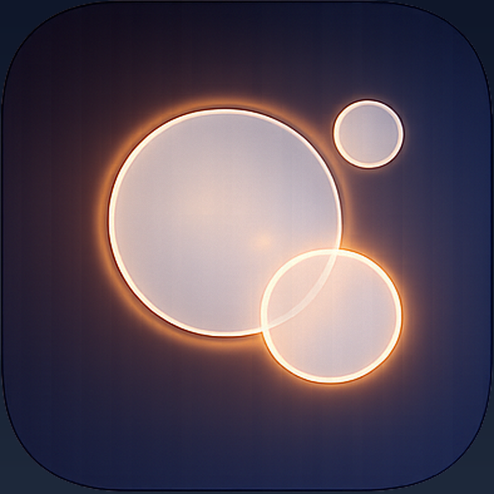
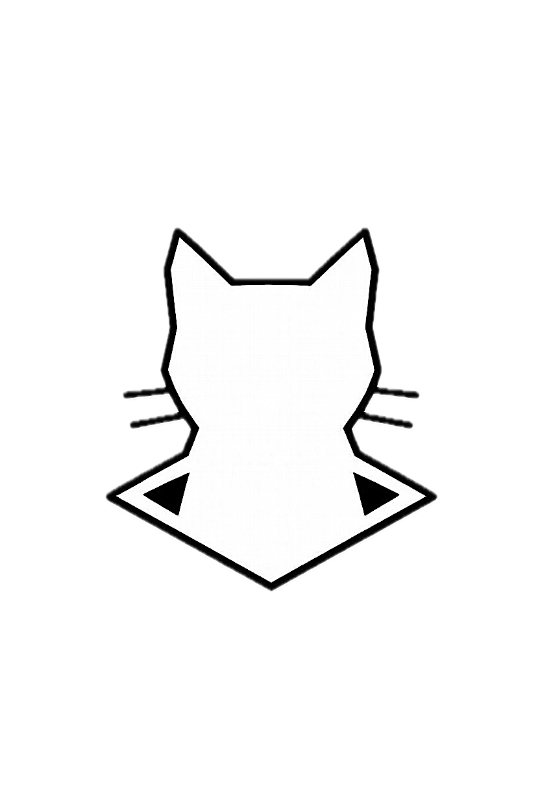
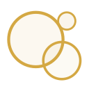

# Self-introduction

## Profile

| key | value |
| --- | --- |
| name | Kaoru Nozue |
| Qiita | @Nozium |
| note | @knozue |
| twitter | @Nozium1 |
| Wantedly | @kaoru_nozue |

## Profile Supplements

| key | value |
| --- | --- |
| Language | JP / EN |
| Background | Nuroscience / Biochemicals / EEG Analytics  |
| Programing Language | Main : Python3 (TS / CV / NLP / web-API)   Sub : HTML / JavaScript / CSS (for mock up product) |
| New Charenge | - ALIFE / WBA  - Knowledge-Graph / AI-Novel-Writing / Knowledge-Compression / Hyper-Availability  - Crypto / x-to-earn  - Join to competitions |
| Hobbies | - Drip and Drink Coffee  - Read new brain-tech / neuro-tech research |

## Products

<table>
  <tr>
    <td align="center" width="50%">
      
       
      <b>AWA - AnytimeWithAgents</b>
       
      思考と実行を拡張するAI OS
       
      AI Agent + SSH Terminal + Apple Intelligence
        
      
    </td>
    <td align="center" width="50%">
      
       
      <b>Colorless Guild</b>
       
      Curiosity is all you need
       
      非貨幣経済コミュニティプラットフォーム
        
      
    </td>
  </tr>
  <tr>
    <td align="center" width="50%">
      
       
      <b>Utakata-SciFi</b>
       
      あなたの明日のサイエンスフィクション
       
      Your science fiction for tomorrow
        
      
    </td>
    <td></td>
  </tr>
</table>

<!--
**Nozium/Nozium** is a ✨ _special_ ✨ repository because its `README.md` (this file) appears on your GitHub profile.

Here are some ideas to get you started:

- 🔭 I'm currently working on ...
- 🌱 I'm currently learning ...
- 👯 I'm looking to collaborate on ...
- 🤔 I'm looking for help with ...
- 💬 Ask me about ...
- 📫 How to reach me: ...
- 😄 Pronouns: ...
- ⚡ Fun fact: ...
-->
