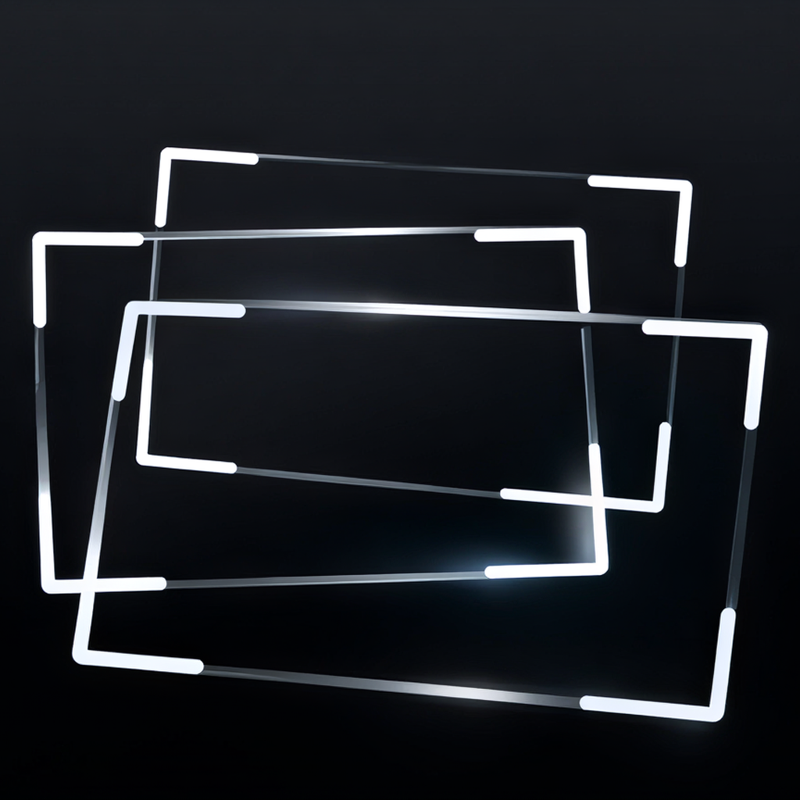
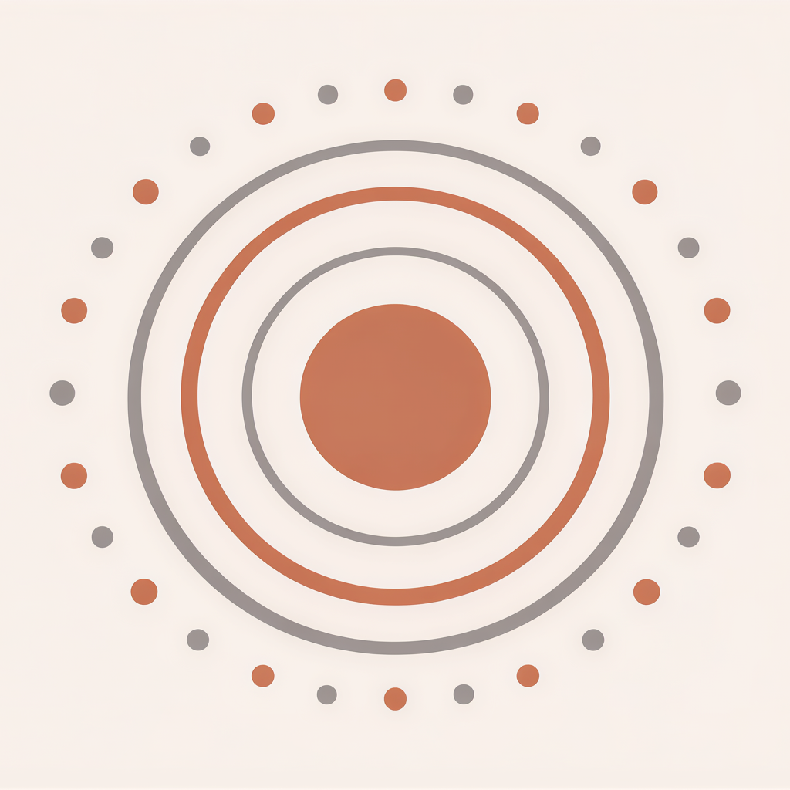
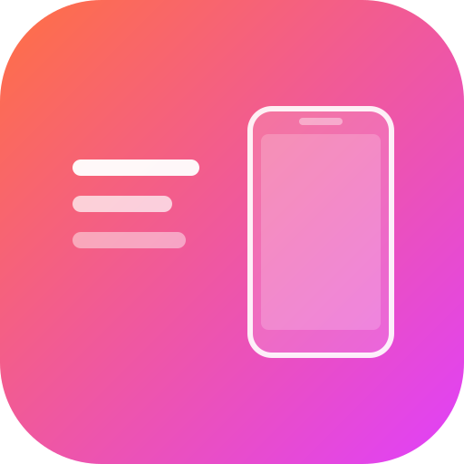

# Self-introduction

## Profile

| key | value |
| --- | --- |
| name | Kaoru Nozue |
| Qiita | @Nozium |
| note | @knozue |
| twitter | @Nozium1 |
| Wantedly | @kaoru_nozue |

## Profile Supplements

| key | value |
| --- | --- |
| Language | JP / EN |
| Background | Nuroscience / Biochemicals / EEG Analytics  |
| Programing Language | Main : Python3 (TS / CV / NLP / web-API)   Sub : HTML / JavaScript / CSS (for mock up product) |
| New Charenge | - ALIFE / WBA  - Knowledge-Graph / AI-Novel-Writing / Knowledge-Compression / Hyper-Availability  - Crypto / x-to-earn  - Join to competitions |
| Hobbies | - Drip and Drink Coffee  - Read new brain-tech / neuro-tech research |

## Products

### Web Service

<table>
  <tr>
    <td width="120">
      
    </td>
    <td>
      <b><a href="https://utakata-scifi.com/">Utakata-SciFi</a></b>
       
      あなたの明日のサイエンスフィクション — Your science fiction for tomorrow
        
      
    </td>
  </tr>
  <tr>
    <td width="120">
      
    </td>
    <td>
      <b><a href="https://colorless-guild.utakata-scifi.com/">Colorless Guild</a></b>
       
      Curiosity is all you need — 非貨幣経済コミュニティプラットフォーム
        
      
    </td>
  </tr>
</table>

### iOS App

<table>
  <tr>
    <td width="120">
      
    </td>
    <td>
      <b><a href="https://apps.apple.com/jp/app/awa-anytimewithagents/id6758113801">AWA - AnytimeWithAgents</a></b>
       
      思考と実行を拡張する AI OS — AI Agent + SSH Terminal + Apple Intelligence
        
      
    </td>
  </tr>
  <tr>
    <td width="120">
      
    </td>
    <td>
      <b><a href="https://apps.apple.com/jp/app/rocketnail/id6759993389">Rocketnail</a></b>
       
      SNS 向けサムネイルメーカー — Create thumbnails for X, YouTube, Instagram, note with text overlays and backgrounds
        
      
    </td>
  </tr>
  <tr>
    <td width="120">
      
    </td>
    <td>
      <b>CloseToMe</b>
       
      位置情報ベースのショート動画アプリ — Capture short location-based video moments and connect with nearby users
        
      
    </td>
  </tr>
  <tr>
    <td width="120">
      
    </td>
    <td>
      <b>moshimo.app</b>
       
      AI ワークフロー自動生成プラットフォーム — 「もしも〇〇だったら」を自然言語で表現すると AI が DAG ワークフローを自動生成・実行
        
      
    </td>
  </tr>
</table>

### DevTool

<table>
  <tr>
    <td width="120">
      
    </td>
    <td>
      <b><a href="https://github.com/Nozium/thumbnail-maker">Thumbnail Maker</a></b>
       
      macOS 向け CLI サムネイル生成ツール — Swift 製コマンドラインツールで画像にテキストオーバーレイを追加
        
      
    </td>
  </tr>
  <tr>
    <td width="120">
      
    </td>
    <td>
      <b><a href="https://github.com/Nozium/rork-asc-support-plugin">rork-asc-support-plugin</a></b>
       
      Claude Code plugin for App Store Connect — IAP/サブスクリプションの設定・診断・審査準備を自動化
        
      
    </td>
  </tr>
  <tr>
    <td width="120">
      
    </td>
    <td>
      <b><a href="https://nozium.github.io/url2qr/">url2qr</a></b>
       
      URL → QR コード変換ツール — Claude Code 等のログイン URL を別端末で素早く開くための小型ユーティリティ。Python CLI（<code>uv run url2qr.py {url}</code>）と Web リレー（GitHub Pages）の 2 形態を提供。
        
      
      
    </td>
  </tr>
  <tr>
    <td width="120">
      
    </td>
    <td>
      <b><a href="https://github.com/Nozium/manashiki-models-swift">manashiki-models-swift</a></b>
       
      Official Swift SDK for Manashiki Models — Edge AI Model Provider。Nozium/manashiki-models の <code>sdk/swift/</code> を自動 mirror して配布。iOS / watchOS / macOS から DLC 取得・SHA-256 verification・device-aware benchmark を呼ぶための公式クライアント。
        
      
      
    </td>
  </tr>
</table>

<!--
**Nozium/Nozium** is a ✨ _special_ ✨ repository because its `README.md` (this file) appears on your GitHub profile.

Here are some ideas to get you started:

- 🔭 I'm currently working on ...
- 🌱 I'm currently learning ...
- 👯 I'm looking to collaborate on ...
- 🤔 I'm looking for help with ...
- 💬 Ask me about ...
- 📫 How to reach me: ...
- 😄 Pronouns: ...
- ⚡ Fun fact: ...
-->
